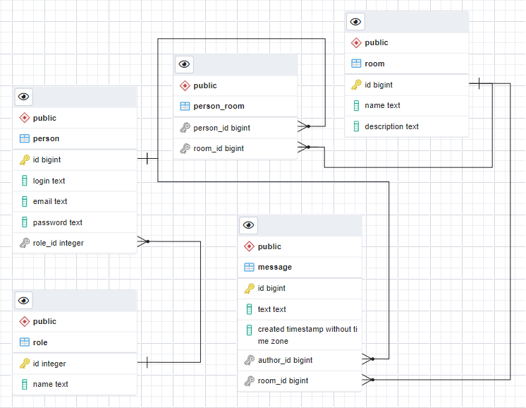

Spring REST API.

#### Описание проекта.

RESTful-приложение с использованием Spring REST API.
Приложение реализует чат с комнатами по стандарту REST API.
Проект использует базу данных PostgreSQL.

#### Таблицы базы данных.

